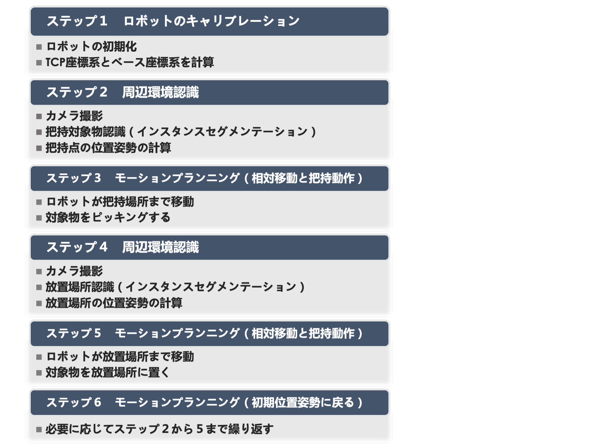
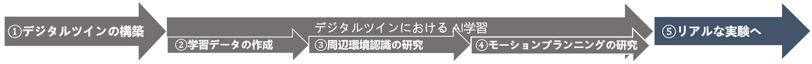
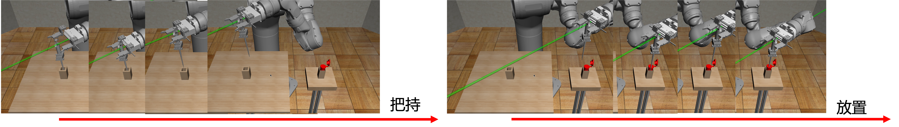
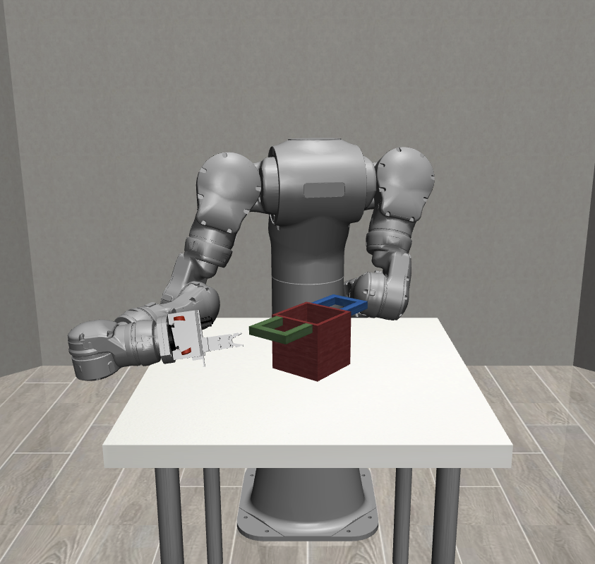
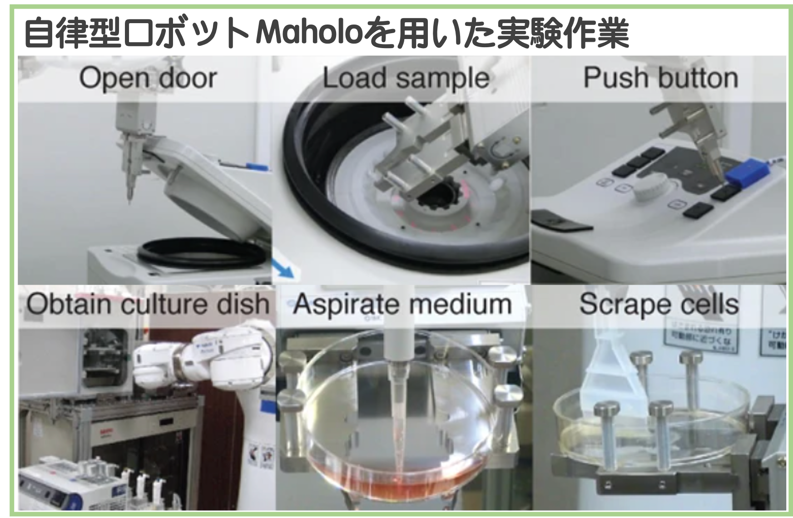

# This is the Auto Lab Robot project in SaitoLab

This is the Doctor research that will start from 2023.

The outline of this research is like this.

* The Steps of Robot Automation is like this.

* To achieve each steps above, I would like to go research in this flows.

* For examples:

  * eg: Using Maholo in robosuite. 

    

  * eg: Maholo in rviz.

    

  * Experiment behaviors.

    

